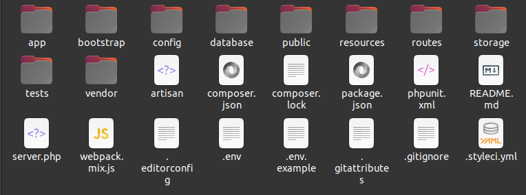
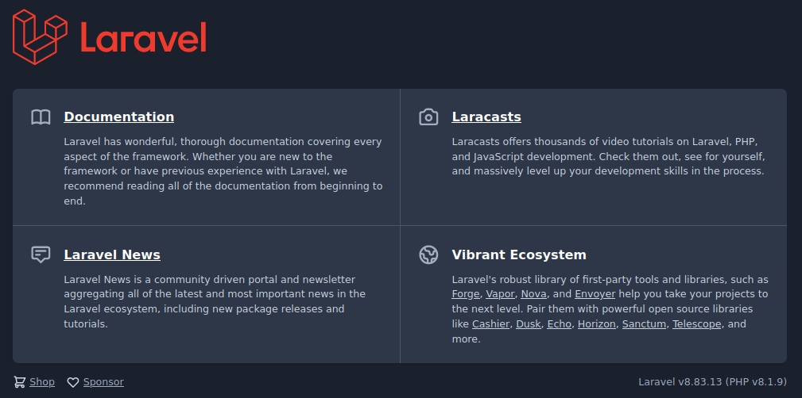

# Rapport technique du stage  de fin L2 2021-2022 Abdoul malik KONDI && n

## Sommaire
Laravel est un frame ....

## Partie 1/n : Installation et organisation d'un projet laravel. 
Dans cette première partie nous allons créer une application Laravel et voir comment le code y est organisé.
En cas générale pour utiliser le framework laravel vous aurez besoins d'au mininume d'une version **7.3** de php
installer sur vos machines, de plusieurs extensions php installer et d'un SGBD (System de Gestion de Base de Données ici nous utiliserons **postgresql**).

### Le serveur.
Pour fonctionner correctement, laravel à besoin de **PHP**:

- Version > **7.3.0**,
- Extension **pdo** 
- Extension **pgsql** ou *mysql* ou autre selon votre SGBD.
- Extension **mbstring**
- Extension **opcache**
- Extension **xml**
- Extension **curl**
- Extension **gd**
- Extension openSSL
- Extension json
- Extension **fileinfo**
- Extension **ctype**
- Extension **BCMath**
- Extension soap
- Extension **zip**
- Extension **intl**
- Extension **common**
- Extension imagick
- Extension **cli**
- Extension **imap**

> NB : Si vous ne savez pas installer php et activer ces extensions cliquer ici.

## Installation d'un projet laravel via composer.
Il y a plusieurs façons de créer une application Laravel. La plus classique consiste à utiliser la commande 
**create-project** de Composer. voici la syntaxe gnérale à utiliser.
`composer create-project laravel/laravel chemain/du/repertoire --prefer-dist "version" `

> Exemple : `composer create-project laravel/laravel application --prefer-dist "8.*" ` . 
> Crée une application Laravel dans le dossier application.

Une fois l'installation démarré, on a plus qu'a attendre quelques minutes pour que Composer fasse son travail
jusqu'au bout. On verra s'afficher une liste de téléchargements. Au final on se retrouve avec cette architechture :

Laravel est équiper d'un server pour le developpement qui se lance avec cette commande :

`php artisan serve`

On peut vérifier que tout fonctionne bien en allant sur l'URL http://127.0.0.1:8000. Normalement on
doit obtenir cette page.

Pour des mises à jour ultérieures il suffit encore d'utiliser Composer avec la commande update :

`composer update`

> **Note :** Si vous installez Laravel en téléchargeant directement les fichiers sur Github et en utilisant
> la commande `composer install`, il vous faut effectuer une action suplémentaires.
> En effet, dans ce cas la clé de sécurité ne sera pas automatiquement créé et vous allez tomber sur une
> erreur au lancement. Il faut donc la créer avec la commande.

`php artisan key:generate`

## Organisation d'un projet laravel.

### Répertoire App.
Le repertoire App est répertoire le plus important de votre projet. C'est lui qui contiendra votre application,
c'est à dire tout votre code php (classes, fonctions ...).

- Console : toutes les commandes en mode console,
- Exceptions : pour gérer les erreurs d'exécution,
- Http : tout ce qui concerne la communication : contrôleurs, middlewares (il y a 8 middlewares
de base qui servent à filtrer les requêtes HTTP) et le kernel,
- Providers : tous les fournisseurs de services (providers), il y en a déjà 5 au départ. Les providers
servent à initialiser les composants.
- Models : le dossier des modèles avec déjà un présent qui concerne les utilisateurs.

### Autres repertoires.

Voici une description du contenu des autres dossiers :
- bootstrap : scripts d'initialisation de Laravel pour le chargement automatique des classes, la
fixation de l'environnement et des chemins, et pour le démarrage de l'application,
- public : tout ce qui doit apparaître dans le dossier public du site : images, CSS, scripts...
- config : toutes les configurations : application, authentification, cache, base de données, espaces
de noms, emails, systèmes de fichier, session...
- database : migrations et populations,
Le dossier database permet la gestion de la base données. Il contient trois sous-dossier.
Les migrations sont des fichiers permettant de décrire votre base de données afin de permettre
à Laravel de créer, modifier ou supprimer les tables et les colonnes automatiquement pour vous.
- resources : vues, fichiers de langage et assets (par exemple les fichiers Sass),
- routes : la gestion des urls d'entrée de l'application,
- storage : données temporaires de l'application : vues compilées, caches, clés de session. . .
- tests : fichiers de tests unitaires,
- vendor : tous les composants de Laravel et de ses dépendances (créé par composer).

### Fichiers de racine.
Il y a un certain nombre de fichiers dans la racine dont voici les principaux :

- artisan : outil en ligne (ligne de commande) de Laravel pour des tâches de gestion,
- composer.json : fichier de référence de composer,
- package.json : fichier de référence de npm pour les assets,
- phpunit.xml : fichier de configuration de phpunit (pour les tests unitaires),
- .env : fichier pour spécifier l'environnement d'exécution.
Les fichiers .env contient les mots de passe de vos services ainsi que toutes les données sensibles
de votre application (mot de passe de base de données, adresse de la base de données...).
Ce fichier ne doit jamais être partagé. Afin de connaître les informations à renseigner, il existe
un fichier .env.example qui contient uniquement des valeurs d'exemple.
Nous verrons tout cela progressivement dans le cours,

### Accessibilité
Pour des raisons de securité sur le serveur seul le dossier public est accessible.

Cette configuration n'est pas toujours possible sur un serveur mutualisé (partagé). Il faut alors modifier 
un tout petit peu Laravel pour que ça fonctionne; nous en palerons peut être dans la partie déployement.

## Installation de debugbar
    Pour installer le debugbar ou même un projet laravel il faut s'assurer que tous 
    indispensable suivant soit activé ou installer pour le faire on utilise décommente
    ces lignes dans le php.ini ou on les installe avec la commandes :

### Commande
    sudo apt-get install php7.4-extension   

#
    Mais ici mon problème c'est que mon php est en version 7.4 or laravel lui il est à 8
    et souhaite que j'ai un php dont la version > 8:
### Résoulution du problème.
    1.Version de php: php -v
    2.Liste des package de php dpkg -l | grep php | tee packages.txt
    3.Suppression de php : sudo apt-get purge php7.*
        - Nétoyage des dépendences php:
            * sudo apt-get autoclean
            * sudo apt-get autoremove
    4.Préparation du système pour une nouvelle réinstallation:

`sudo add-apt-repository ppa:ondrej/php`
    
    5.Installation de php 
        * sudo apt-get update
        * sudo apt-get install php8.1
        * sudo systemctl restart apache2
    6.Installation des instensions php:

`sudo apt install php8.1-common php8.1-mysql php8.1-xml php8.1-xmlrpc php8.1-curl php8.1-gd php8.1-imagick php8.1-cli php8.1-dev php8.1-imap php8.1-mbstring php8.1-opcache php8.1-soap php8.1-zip php8.1-intl -y`

    7.Vérification de la nouvelle version : php -v

    Pour installer le debuge bar il faut lancer la commande:

`composer require barryvdh/laravel-debugbar:* --dev`

## Installation du package helper

`composer require mercuryseries/laravel-helpers `

    Ajout d'un provider
    Barryvdh\LaravelIdeHelper\IdeHelperServiceProvider::class,
    
### Usage
    `php artisan ide-helper:generate`    

## Installation de Tailwindcss
    NB: Pour plus d'information allez sur la doc
    de tailwindcss => https://tailwindcss.com/docs/guides/laravel
   
    sudo apt update
    sudo apt install nodejs npm

    npm install -D tailwindcss postcss autoprefixer
    npx tailwindcss init -p

## Pagination with tailwindcss
    npm i tailwindcss-plugins -D

## Installation du module pour l'importation en excel.

    composer require maatwebsite/excel
    php artisan vendor:publish --provider="Maatwebsite\Excel\ExcelServiceProvider" --tag=config
    php artisan make:import UsersImport --model=User

## Installation du module de qr-code

    composer require simplesoftwareio/simple-qrcode "~4"
    
## Authentification.
composer require laravel/breeze --dev 
    
